# Dokumentasi Proyek Data Warehouse
## Perusahaan Kurir Skala Kecil–Menengah

---

## 1. Latar Belakang

Perusahaan kurir skala kecil–menengah memerlukan sistem analitik untuk memantau performa pengiriman, efisiensi operasional, dan perilaku pelanggan. Data transaksional yang tersebar di berbagai sistem operasional perlu dikonsolidasikan ke dalam satu **Data Warehouse** agar dapat dianalisis secara terpusat.

Proyek ini membangun Data Warehouse menggunakan pendekatan **Kimball Dimensional Modeling** dengan arsitektur **Star Schema**.

---

## 2. Tujuan Proyek

| No | Tujuan |
|----|--------|
| 1 | Membangun Data Warehouse berbasis Star Schema untuk analisis pengiriman |
| 2 | Melakukan simulasi proses **ETL** (Extract, Transform, Load) |
| 3 | Menyediakan data yang konsisten untuk pembuatan dashboard **Power BI** |
| 4 | Menganalisis performa pengiriman: on-time, terlambat, gagal, returned, cancelled |
| 5 | Mendukung pengambilan keputusan berbasis data |

---

## 3. Ruang Lingkup

- **Periode Data**: Januari – Desember 2025 (1 tahun penuh)
- **Sumber Data**: Data dummy simulasi (CSV)
- **Database**: Microsoft SQL Server
- **Visualisasi**: Microsoft Power BI
- **Skala**: 350 transaksi pengiriman, 75 pelanggan, 13 cabang, 25 kurir

---

## 4. Arsitektur Sistem

```
┌──────────────┐     ┌──────────────┐     ┌──────────────┐     ┌──────────────┐
│  Data Source  │────▶│   Staging    │────▶│     Data     │────▶│   Power BI   │
│  (CSV Files) │     │    Area      │     │  Warehouse   │     │  Dashboard   │
└──────────────┘     └──────────────┘     └──────────────┘     └──────────────┘
       10 file          BULK INSERT        Star Schema           Visualisasi
       CSV              + Cleaning         9 Dim + 1 Fact        & Analisis
```

### Alur Proses

| Tahap | Proses | Tools |
|-------|--------|-------|
| **Extract** | Import file CSV ke staging area | SQL Server BULK INSERT |
| **Transform** | Validasi tipe data, handle NULL, business rules | Stored Procedure / SSIS |
| **Load** | Insert ke tabel dimensi dan fakta | Stored Procedure |
| **Visualize** | Koneksi ke Power BI, buat dashboard | Power BI Desktop |

---

## 5. Desain Star Schema

### 5.1 Diagram Star Schema

```mermaid
graph TB
    DimDate["<b>DimDate</b><br/>365 baris<br/>─────────<br/>PK: date_key"]
    DimCustomer["<b>DimCustomer</b><br/>75 baris<br/>─────────<br/>PK: customer_key"]
    DimBranch["<b>DimBranch</b><br/>13 baris<br/>─────────<br/>PK: branch_key"]
    DimCourier["<b>DimCourier</b><br/>25 baris<br/>─────────<br/>PK: courier_key"]
    DimService["<b>DimService</b><br/>6 baris<br/>─────────<br/>PK: service_key"]
    DimPackage["<b>DimPackage</b><br/>80 baris<br/>─────────<br/>PK: package_key"]
    DimShipmentStatus["<b>DimShipmentStatus</b><br/>8 baris<br/>─────────<br/>PK: status_key"]
    DimRoute["<b>DimRoute</b><br/>20 baris<br/>─────────<br/>PK: route_key"]
    DimPayment["<b>DimPayment</b><br/>80 baris<br/>─────────<br/>PK: payment_key"]

    Fact["<b>⭐ FactDeliveryPerformance</b><br/>350 baris<br/>═══════════════════<br/>11 Foreign Keys<br/>10 Measures + 5 Flags"]

    DimDate -- "transaction_date_key<br/>pickup_date_key<br/>delivery_date_key" --> Fact
    DimCustomer -- "customer_key" --> Fact
    DimBranch -- "branch_key" --> Fact
    DimCourier -- "courier_key" --> Fact
    DimService -- "service_key" --> Fact
    DimPackage -- "package_key" --> Fact
    DimShipmentStatus -- "status_key" --> Fact
    DimRoute -- "route_key" --> Fact
    DimPayment -- "payment_key" --> Fact

    style Fact fill:#1a1a2e,stroke:#e94560,stroke-width:3px,color:#ffffff
    style DimDate fill:#16213e,stroke:#0f3460,stroke-width:2px,color:#e0e0e0
    style DimCustomer fill:#16213e,stroke:#0f3460,stroke-width:2px,color:#e0e0e0
    style DimBranch fill:#16213e,stroke:#0f3460,stroke-width:2px,color:#e0e0e0
    style DimCourier fill:#16213e,stroke:#0f3460,stroke-width:2px,color:#e0e0e0
    style DimService fill:#16213e,stroke:#0f3460,stroke-width:2px,color:#e0e0e0
    style DimPackage fill:#16213e,stroke:#0f3460,stroke-width:2px,color:#e0e0e0
    style DimShipmentStatus fill:#16213e,stroke:#0f3460,stroke-width:2px,color:#e0e0e0
    style DimRoute fill:#16213e,stroke:#0f3460,stroke-width:2px,color:#e0e0e0
    style DimPayment fill:#16213e,stroke:#0f3460,stroke-width:2px,color:#e0e0e0
```



### 5.2 Ringkasan Tabel

| No | Nama Tabel | Tipe | Jumlah Kolom | Jumlah Baris | Deskripsi |
|----|-----------|------|:------------:|:------------:|-----------|
| 1 | DimDate | Dimension | 9 | 365 | Kalender 1 tahun penuh (2025) |
| 2 | DimCustomer | Dimension | 11 | 75 | Data pelanggan pengirim |
| 3 | DimBranch | Dimension | 11 | 13 | Cabang / agen perusahaan |
| 4 | DimCourier | Dimension | 10 | 25 | Data kurir pengantar |
| 5 | DimService | Dimension | 8 | 6 | Jenis layanan pengiriman |
| 6 | DimPackage | Dimension | 13 | 80 | Detail paket yang dikirim |
| 7 | DimShipmentStatus | Dimension | 5 | 8 | Status pengiriman |
| 8 | DimRoute | Dimension | 9 | 20 | Rute asal–tujuan |
| 9 | DimPayment | Dimension | 9 | 80 | Informasi pembayaran |
| 10 | FactDeliveryPerformance | Fact | 25 | 350 | Transaksi pengiriman |

> [!IMPORTANT]
> **Role-Playing Dimension**: Tabel `DimDate` digunakan 3 kali dengan peran berbeda — sebagai tanggal transaksi (`transaction_date_key`), tanggal pickup (`pickup_date_key`), dan tanggal delivery (`delivery_date_key`).

---

## 6. Data Dictionary

### 6.1 DimDate — Dimensi Waktu

Berisi kalender lengkap tahun 2025 (365 baris).

| Kolom | Tipe Data | Nullable | Deskripsi | Contoh |
|-------|-----------|:--------:|-----------|--------|
| `date_key` | INT | No | **Primary Key** — Surrogate key | 1 |
| `full_date` | DATE | No | Tanggal lengkap | 2025-01-01 |
| `day_number` | INT | No | Tanggal dalam bulan (1–31) | 15 |
| `day_name` | VARCHAR(10) | No | Nama hari (Bahasa Indonesia) | Senin |
| `month_number` | INT | No | Nomor bulan (1–12) | 3 |
| `month_name` | VARCHAR(15) | No | Nama bulan (Bahasa Indonesia) | Maret |
| `quarter_number` | INT | No | Nomor kuartal (1–4) | 1 |
| `year_number` | INT | No | Tahun | 2025 |
| `is_weekend` | BIT | No | 1 = Sabtu/Minggu, 0 = Hari kerja | 0 |

---

### 6.2 DimCustomer — Dimensi Pelanggan

Berisi data pelanggan yang menggunakan jasa pengiriman.

| Kolom | Tipe Data | Nullable | Deskripsi | Contoh |
|-------|-----------|:--------:|-----------|--------|
| `customer_key` | INT | No | **Primary Key** — Surrogate key | 1 |
| `customer_id` | VARCHAR(10) | No | ID pelanggan (business key) | CUST-0001 |
| `customer_name` | VARCHAR(100) | No | Nama lengkap pelanggan | Budi Saputra |
| `customer_type` | VARCHAR(20) | No | Tipe: Individual / Bisnis / Korporat | Individual |
| `gender` | VARCHAR(15) | No | Jenis kelamin | Laki-laki |
| `phone` | VARCHAR(15) | **Yes** | Nomor telepon | 081234567890 |
| `email` | VARCHAR(100) | **Yes** | Alamat email | budi@gmail.com |
| `city` | VARCHAR(50) | No | Kota domisili | Bandung |
| `province` | VARCHAR(50) | No | Provinsi domisili | Jawa Barat |
| `registration_date` | DATE | No | Tanggal registrasi pelanggan | 2023-05-15 |
| `is_active` | BIT | No | 1 = Aktif, 0 = Non-aktif | 1 |

> [!NOTE]
> Kolom `phone` dan `email` dapat bernilai NULL untuk simulasi data tidak lengkap pada proses ETL.

---

### 6.3 DimBranch — Dimensi Cabang

Berisi data cabang/agen perusahaan kurir.

| Kolom | Tipe Data | Nullable | Deskripsi | Contoh |
|-------|-----------|:--------:|-----------|--------|
| `branch_key` | INT | No | **Primary Key** — Surrogate key | 1 |
| `branch_id` | VARCHAR(10) | No | ID cabang (business key) | BR-001 |
| `branch_name` | VARCHAR(50) | No | Nama cabang | Cabang Jakarta Pusat |
| `branch_type` | VARCHAR(15) | No | Tipe: Pusat / Cabang / Agen | Pusat |
| `address` | VARCHAR(200) | No | Alamat lengkap | Jl. Sudirman No. 10, Jakarta |
| `city` | VARCHAR(50) | No | Kota lokasi cabang | Jakarta Pusat |
| `province` | VARCHAR(50) | No | Provinsi | DKI Jakarta |
| `region` | VARCHAR(30) | No | Region operasional | Jabodetabek |
| `manager_name` | VARCHAR(100) | No | Nama kepala cabang | Ahmad Wijaya |
| `opening_date` | DATE | No | Tanggal pembukaan cabang | 2019-08-22 |
| `is_active` | BIT | No | 1 = Aktif, 0 = Non-aktif | 1 |

**Daftar Region:**

| Region | Provinsi |
|--------|----------|
| Jabodetabek | DKI Jakarta, Banten |
| Jawa | Jawa Barat, Jawa Tengah, Jawa Timur |
| Sumatera | Sumatera Utara, Sumatera Barat, Sumatera Selatan, Riau, Lampung |
| Kalimantan | Kalimantan Selatan, Kalimantan Timur |
| Sulawesi | Sulawesi Selatan |
| Bali & Nusa Tenggara | Bali, NTB |

---

### 6.4 DimCourier — Dimensi Kurir

Berisi data kurir yang bertugas mengantar paket.

| Kolom | Tipe Data | Nullable | Deskripsi | Contoh |
|-------|-----------|:--------:|-----------|--------|
| `courier_key` | INT | No | **Primary Key** — Surrogate key | 1 |
| `courier_id` | VARCHAR(10) | No | ID kurir (business key) | KR-0001 |
| `courier_name` | VARCHAR(100) | No | Nama lengkap kurir | Eko Prasetyo |
| `gender` | VARCHAR(15) | No | Jenis kelamin | Laki-laki |
| `phone` | VARCHAR(15) | No | Nomor telepon kurir | 081298765432 |
| `branch_id` | VARCHAR(10) | No | ID cabang tempat bertugas (→ DimBranch) | BR-001 |
| `vehicle_type` | VARCHAR(15) | No | Jenis kendaraan | Motor |
| `hire_date` | DATE | No | Tanggal mulai bekerja | 2021-03-15 |
| `employee_status` | VARCHAR(15) | No | Status: Tetap / Kontrak / Freelance | Tetap |
| `is_active` | BIT | No | 1 = Aktif, 0 = Non-aktif | 1 |

**Distribusi Kendaraan:**

| Jenis Kendaraan | Keterangan |
|-----------------|------------|
| Motor | Pengiriman dalam kota, paket kecil–sedang |
| Mobil Van | Pengiriman volume menengah |
| Mobil Box | Pengiriman volume besar / antar kota |
| Sepeda | Pengiriman jarak pendek, area urban |

---

### 6.5 DimService — Dimensi Layanan

Berisi jenis layanan pengiriman yang tersedia.

| Kolom | Tipe Data | Nullable | Deskripsi | Contoh |
|-------|-----------|:--------:|-----------|--------|
| `service_key` | INT | No | **Primary Key** — Surrogate key | 1 |
| `service_code` | VARCHAR(5) | No | Kode layanan | REG |
| `service_name` | VARCHAR(20) | No | Nama layanan | Regular |
| `service_category` | VARCHAR(15) | No | Kategori: Standard / Premium / Logistik | Standard |
| `delivery_estimation` | VARCHAR(20) | No | Estimasi waktu kirim | 3-5 hari |
| `max_weight` | DECIMAL(5,1) | No | Berat maksimal (kg) | 30.0 |
| `is_cod_available` | BIT | No | 1 = COD tersedia | 1 |
| `is_active` | BIT | No | 1 = Layanan aktif | 1 |

**Daftar Layanan:**

| Kode | Nama | Kategori | Estimasi | Maks Berat |
|------|------|----------|----------|:----------:|
| REG | Regular | Standard | 3-5 hari | 30 kg |
| EXP | Express | Premium | 1-2 hari | 20 kg |
| ONS | Same Day | Premium | Hari yang sama | 10 kg |
| ECO | Ekonomi | Standard | 5-7 hari | 50 kg |
| CGO | Cargo | Logistik | 5-10 hari | 100 kg |
| INS | Instant | Premium | 2-4 jam | 5 kg |

---

### 6.6 DimPackage — Dimensi Paket

Berisi detail fisik dan deskripsi setiap paket.

| Kolom | Tipe Data | Nullable | Deskripsi | Contoh |
|-------|-----------|:--------:|-----------|--------|
| `package_key` | INT | No | **Primary Key** — Surrogate key | 1 |
| `package_id` | VARCHAR(12) | No | ID paket (business key) | PKG-00001 |
| `package_type` | VARCHAR(15) | No | Jenis kemasan | Box |
| `package_category` | VARCHAR(10) | No | Ukuran: Kecil / Sedang / Besar | Sedang |
| `weight` | DECIMAL(6,2) | No | Berat (kg) | 3.50 |
| `weight_category` | VARCHAR(15) | No | Kategori berat | Sedang |
| `length_cm` | INT | No | Panjang (cm) | 30 |
| `width_cm` | INT | No | Lebar (cm) | 20 |
| `height_cm` | INT | No | Tinggi (cm) | 15 |
| `volume_cm3` | INT | No | Volume (cm³) = P × L × T | 9000 |
| `is_fragile` | BIT | No | 1 = Barang mudah pecah | 0 |
| `is_insured` | BIT | No | 1 = Diasuransikan | 1 |
| `item_description` | VARCHAR(100) | **Yes** | Deskripsi isi paket | Elektronik - Smartphone |

**Kategori Berat:**

| Kategori | Rentang Berat |
|----------|:------------:|
| Ringan | ≤ 1 kg |
| Sedang | 1 – 5 kg |
| Berat | 5 – 15 kg |
| Sangat Berat | > 15 kg |

---

### 6.7 DimShipmentStatus — Dimensi Status Pengiriman

Berisi daftar status yang dapat dimiliki pengiriman.

| Kolom | Tipe Data | Nullable | Deskripsi | Contoh |
|-------|-----------|:--------:|-----------|--------|
| `status_key` | INT | No | **Primary Key** — Surrogate key | 1 |
| `status_code` | VARCHAR(15) | No | Kode status | DELIVERED |
| `status_name` | VARCHAR(30) | No | Nama status | Delivered |
| `status_category` | VARCHAR(10) | No | Kategori: Proses / Selesai / Gagal / Batal | Selesai |
| `status_description` | VARCHAR(100) | No | Penjelasan status | Paket berhasil diterima |

**Daftar Status:**

| Kode | Nama | Kategori | Keterangan |
|------|------|----------|------------|
| PICKUP | Picked Up | Proses | Paket dijemput dari pengirim |
| INTRANSIT | In Transit | Proses | Dalam perjalanan |
| ONSORTIR | On Sorting | Proses | Sedang disortir di gudang |
| OUTDELIVERY | Out for Delivery | Proses | Sedang diantar ke penerima |
| DELIVERED | Delivered | Selesai | Berhasil diterima penerima |
| FAILED | Failed Delivery | Gagal | Pengiriman gagal |
| RETURNED | Returned to Sender | Gagal | Dikembalikan ke pengirim |
| CANCELLED | Cancelled | Batal | Pengiriman dibatalkan |

---

### 6.8 DimRoute — Dimensi Rute

Berisi rute pengiriman dari kota asal ke kota tujuan.

| Kolom | Tipe Data | Nullable | Deskripsi | Contoh |
|-------|-----------|:--------:|-----------|--------|
| `route_key` | INT | No | **Primary Key** — Surrogate key | 1 |
| `route_id` | VARCHAR(10) | No | ID rute (business key) | RT-001 |
| `origin_city` | VARCHAR(50) | No | Kota asal | Jakarta Pusat |
| `destination_city` | VARCHAR(50) | No | Kota tujuan | Bandung |
| `origin_region` | VARCHAR(30) | No | Region asal | Jabodetabek |
| `destination_region` | VARCHAR(30) | No | Region tujuan | Jawa |
| `distance_km` | INT | No | Jarak tempuh (km) | 150 |
| `route_type` | VARCHAR(30) | No | Tipe rute | Inter-Region (Jawa) |
| `is_active` | BIT | No | 1 = Rute aktif | 1 |

**Tipe Rute:**

| Tipe | Keterangan |
|------|------------|
| Intra-Region | Asal dan tujuan di region yang sama |
| Inter-Region (Jawa) | Antar region di Pulau Jawa |
| Inter-Region (Luar Jawa) | Melibatkan region di luar Jawa |

---

### 6.9 DimPayment — Dimensi Pembayaran

Berisi informasi pembayaran untuk setiap transaksi.

| Kolom | Tipe Data | Nullable | Deskripsi | Contoh |
|-------|-----------|:--------:|-----------|--------|
| `payment_key` | INT | No | **Primary Key** — Surrogate key | 1 |
| `payment_id` | VARCHAR(12) | No | ID pembayaran (business key) | PAY-00001 |
| `payment_method` | VARCHAR(20) | No | Metode pembayaran | Transfer Bank |
| `payment_channel` | VARCHAR(20) | No | Channel pembayaran | Mobile Banking |
| `bank_name` | VARCHAR(20) | **Yes** | Nama bank (NULL jika e-wallet/COD) | BCA |
| `payment_date` | DATE | No | Tanggal pembayaran | 2025-03-15 |
| `payment_status` | VARCHAR(10) | No | Status: Lunas / Pending / Gagal | Lunas |
| `is_cod` | BIT | No | 1 = Cash on Delivery | 0 |
| `refund_status` | VARCHAR(20) | No | Status refund | Tidak Ada |

---

### 6.10 FactDeliveryPerformance — Tabel Fakta

Tabel fakta utama yang mencatat setiap transaksi pengiriman. **1 baris = 1 pengiriman.**

#### Foreign Keys (11 kolom)

| Kolom | Tipe Data | Nullable | Referensi | Deskripsi |
|-------|-----------|:--------:|-----------|-----------|
| `shipment_key` | INT | No | **Primary Key** | Surrogate key |
| `shipment_id` | VARCHAR(12) | No | — | ID pengiriman | 
| `awb_number` | VARCHAR(20) | No | — | Nomor resi (Air Waybill) |
| `transaction_date_key` | INT | No | → DimDate | Tanggal transaksi dibuat |
| `pickup_date_key` | INT | **Yes** | → DimDate | Tanggal paket dijemput |
| `delivery_date_key` | INT | **Yes** | → DimDate | Tanggal paket diterima |
| `customer_key` | INT | No | → DimCustomer | Pelanggan pengirim |
| `branch_key` | INT | No | → DimBranch | Cabang pengelola |
| `courier_key` | INT | No | → DimCourier | Kurir pengantar |
| `service_key` | INT | No | → DimService | Jenis layanan |
| `package_key` | INT | No | → DimPackage | Detail paket |
| `status_key` | INT | No | → DimShipmentStatus | Status akhir |
| `route_key` | INT | No | → DimRoute | Rute pengiriman |
| `payment_key` | INT | No | → DimPayment | Info pembayaran |

#### Measures (10 kolom)

| Kolom | Tipe Data | Nullable | Tipe Measure | Deskripsi |
|-------|-----------|:--------:|:------------:|-----------|
| `total_shipment` | INT | No | Additive | Selalu = 1 (untuk agregasi COUNT) |
| `estimated_days` | INT | No | Non-additive | Estimasi hari pengiriman |
| `actual_days` | INT | **Yes** | Non-additive | Hari aktual pengiriman |
| `delay_days` | INT | **Yes** | Non-additive | Hari keterlambatan |
| `package_weight` | DECIMAL(6,2) | No | Additive | Berat paket (kg) |
| `shipping_fee` | INT | No | Additive | Biaya pengiriman (Rp) |
| `insurance_fee` | INT | No | Additive | Biaya asuransi (Rp) |
| `discount_amount` | INT | No | Additive | Diskon (Rp) |
| `total_amount` | INT | No | Additive | Total bayar (Rp) |

#### Flags (5 kolom)

| Kolom | Tipe Data | Nullable | Deskripsi |
|-------|-----------|:--------:|-----------|
| `is_delivered` | BIT | No | 1 jika status = DELIVERED |
| `is_late` | BIT | No | 1 jika delay_days > 0 |
| `is_failed` | BIT | No | 1 jika status = FAILED |
| `is_returned` | BIT | No | 1 jika status = RETURNED |
| `is_cancelled` | BIT | No | 1 jika status = CANCELLED |

---

## 7. Business Rules & Kalkulasi

### 7.1 Perhitungan di Fact Table

```
total_amount = shipping_fee + insurance_fee - discount_amount
```

### 7.2 Aturan delay_days

```
JIKA actual_days IS NULL       → delay_days = NULL
JIKA actual_days ≤ estimated_days  → delay_days = 0
JIKA actual_days > estimated_days  → delay_days = actual_days - estimated_days
```

### 7.3 Aturan Flag

| Flag | Kondisi |
|------|---------|
| `is_delivered = 1` | status_code = 'DELIVERED' |
| `is_late = 1` | delay_days > 0 |
| `is_failed = 1` | status_code = 'FAILED' |
| `is_returned = 1` | status_code = 'RETURNED' |
| `is_cancelled = 1` | status_code = 'CANCELLED' |

### 7.4 Aturan NULL

| Kolom | Kapan NULL | Alasan |
|-------|-----------|--------|
| `actual_days` | Status masih proses atau cancelled | Pengiriman belum selesai |
| `delay_days` | actual_days NULL | Tidak bisa dihitung |
| `delivery_date_key` | Status masih proses atau cancelled | Belum diterima |
| `phone` (DimCustomer) | ~5% data | Simulasi data tidak lengkap |
| `email` (DimCustomer) | ~8% data | Simulasi data tidak lengkap |
| `item_description` (DimPackage) | Beberapa paket | Pengirim tidak mengisi |
| `bank_name` (DimPayment) | Metode E-Wallet atau COD | Tidak menggunakan bank |

---

## 8. Statistik Data

### 8.1 Distribusi Status Pengiriman

| Status | Jumlah | Persentase |
|--------|:------:|:----------:|
| Delivered (berhasil) | 248 | 70.9% |
| In Progress (proses) | 62 | 17.7% |
| Failed (gagal) | 16 | 4.6% |
| Cancelled (batal) | 15 | 4.3% |
| Returned (retur) | 9 | 2.6% |

### 8.2 Ketepatan Waktu (dari yang Delivered)

| Kategori | Keterangan |
|----------|------------|
| On-time | actual_days ≤ estimated_days |
| Late | actual_days > estimated_days (delay_days > 0) |

### 8.3 Cakupan Geografis

- **15 provinsi** di Indonesia
- **6 region** operasional
- **20 rute** pengiriman aktif
- Konsentrasi utama: **Jawa & Jabodetabek**

---

## 9. Rencana Dashboard Power BI

### 9.1 Halaman Dashboard

| No | Halaman | KPI Utama |
|----|---------|-----------|
| 1 | **Overview** | Total pengiriman, revenue, delivery rate, on-time rate |
| 2 | **Delivery Performance** | Tren on-time vs late, rata-rata delay, distribusi status |
| 3 | **Branch Analysis** | Performa per cabang, volume per region |
| 4 | **Courier Performance** | Jumlah pengiriman per kurir, success rate |
| 5 | **Financial** | Revenue per layanan, rata-rata biaya kirim, diskon |
| 6 | **Customer Insights** | Distribusi tipe pelanggan, top customers |

### 9.2 Contoh KPI Measures (DAX)

```
Total Pengiriman   = SUM(FactDeliveryPerformance[total_shipment])
Total Revenue      = SUM(FactDeliveryPerformance[total_amount])
Delivery Rate (%)  = DIVIDE(SUM([is_delivered]), SUM([total_shipment])) × 100
On-Time Rate (%)   = DIVIDE(SUM([total_shipment]) - SUM([is_late]), SUM([is_delivered])) × 100
Avg Delay (hari)   = AVERAGE(FactDeliveryPerformance[delay_days])
```

---

## 10. Daftar File Proyek

| File | Lokasi | Keterangan |
|------|--------|------------|
| `generate_dummy_data.py` | Root | Script Python generator data |
| `DimDate.csv` | csv/ | Data dimensi waktu |
| `DimCustomer.csv` | csv/ | Data dimensi pelanggan |
| `DimBranch.csv` | csv/ | Data dimensi cabang |
| `DimCourier.csv` | csv/ | Data dimensi kurir |
| `DimService.csv` | csv/ | Data dimensi layanan |
| `DimPackage.csv` | csv/ | Data dimensi paket |
| `DimShipmentStatus.csv` | csv/ | Data dimensi status |
| `DimRoute.csv` | csv/ | Data dimensi rute |
| `DimPayment.csv` | csv/ | Data dimensi pembayaran |
| `FactDeliveryPerformance.csv` | csv/ | Data tabel fakta |
| `star_schema_mermaid.txt` | Root | Kode Mermaid star schema |

---

> **Disusun untuk**: Proyek Mata Kuliah Data Warehouse  
> **Tanggal**: Mei 2025  
> **Tools**: SQL Server · Power BI · Python · Mermaid
